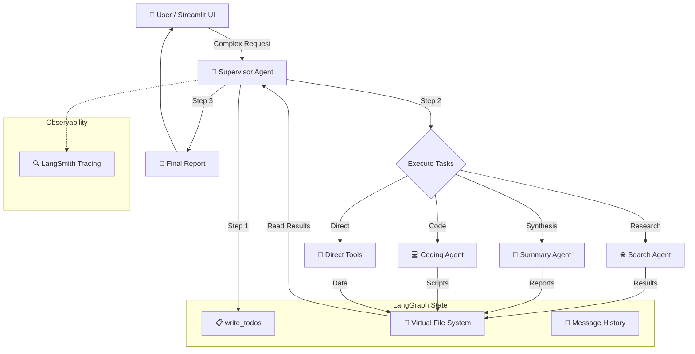

# Architecture Overview

## System Architecture

The Autonomous Cognitive Engine is a multi-agent AI system built on LangGraph that performs deep research and complex, long-horizon tasks through structured planning, context management, and sub-agent delegation.



## Core Components

### 1. LangGraph StateGraph (`src/agent/graph.py`)
- Defines the ReAct loop: `START → agent → tools → agent → ... → END`
- Uses `MemorySaver` checkpointer for conversation persistence
- `should_continue()` router decides: call more tools or finish

### 2. Agent State (`src/agent/state.py`)
Central state schema managed by LangGraph:

| Field | Type | Purpose |
|-------|------|---------|
| `messages` | `list[BaseMessage]` | Conversation history (from MessagesState) |
| `todos` | `list[TodoItem]` | Task plan items with status tracking |
| `files` | `dict[str, str]` | Virtual file system {path: content} |
| `iteration_count` | `int` | Loop iteration counter |
| `plan_created` | `bool` | Whether initial plan exists |
| `current_todo_id` | `int` | Currently active task ID |

### 3. Agent Node (`src/agent/nodes.py`)
The reasoning engine:
- Builds system prompt with current context (todos + files)
- Calls Groq LLM with tool bindings
- Handles Groq XML parsing errors (tool_use_failed recovery)
- Includes safety check for write_todos on first iteration
- Programmatic fallback plan if write_todos fails after 2 iterations

### 4. Tool Node (`src/agent/nodes.py`)
Executes tool calls:
- Routes to planning, filesystem, delegation, or search handlers
- Merges state updates from tool results
- Handles errors gracefully

### 5. Sub-Agent System (`src/agent/sub_agents/registry.py`)
Specialized workers with isolated context:

| Agent | Tools | Purpose |
|-------|-------|---------|
| `search_agent` | `web_search` | Web research, fact gathering |
| `summary_agent` | `read_file`, `write_file`, `edit_file`, `ls` | Synthesis, report drafting |
| `coding_agent` | `write_file`, `read_file`, `edit_file`, `ls` | Scripts, data processing |

Each sub-agent:
- Gets a copy of the virtual file system (context isolation)
- Runs its own ReAct loop (max 5 iterations)
- Returns response + modified files to the supervisor

### 6. Streamlit Frontend (`frontend/app.py`)
Real-time UI with:
- Chat interface with markdown rendering
- Task Plan sidebar with progress bar
- Delegation activity panel
- Virtual file system browser
- Session stats (messages, iterations, TODOs, files)
- LangSmith tracing link

## Data Flow

```
1. User sends query via Streamlit
2. Graph invoked with HumanMessage
3. Agent creates plan (write_todos → 5 tasks)
4. For each task:
   a. Agent calls update_todo(id, "in_progress")
   b. Agent delegates to sub-agent OR uses tools directly
   c. Sub-agent executes with isolated VFS
   d. Results merged back into main state
   e. Agent calls update_todo(id, "completed")
5. Agent reads VFS files and produces final report
6. Report displayed in Streamlit main chat
```

## Error Recovery

### Groq XML Parser
When Groq returns `tool_use_failed` errors, the system:
1. Extracts `failed_generation` from the error JSON
2. Parses `<function=name>{args}</function>` XML patterns
3. Creates proper `AIMessage` with parsed tool calls
4. Falls back to plain text mode after repeated failures

### Rate Limit Handling
- 20-second cooldown between sub-agent delegations
- Exponential backoff: 30s + 20s × attempt for rate limit retries
- Max 5 retries per LLM call

### Plan Reliability
- Safety check forces write_todos on first iteration
- Programmatic fallback creates plan from query if write_todos fails after 2 iterations
- Auto-completes remaining todos when agent finishes
